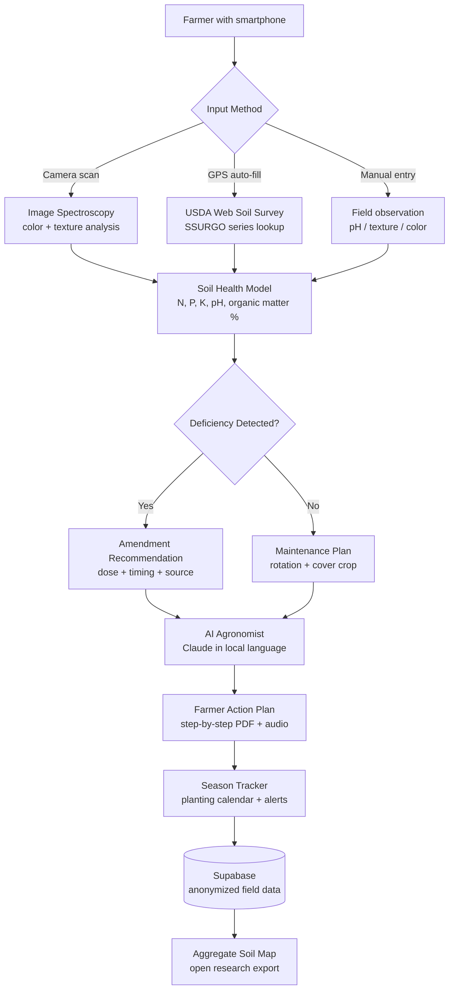

<p align="center">
  <h1 align="center">foundation-soil-sense</h1>
  <h3 align="center"><em>Phone-based soil analysis for the 500 million smallholder farms that feed the world.</em></h3>
</p>

<p align="center">
  <a href="LICENSE"></a>
  
  
  <a href="https://mama.oliwoods.ai"></a>
  <a href="https://mama.oliwoods.ai/foundation"></a>
</p>

---

> *"Soil degradation costs the global economy $40 billion per year and has already affected 33% of the world's agricultural land — threatening the food security of 3.2 billion people."*
> — UNCCD Global Land Outlook, 2022

---

## Why This Exists

Healthy soil is the foundation of all food. But the farmers who grow most of the world's food — 500 million smallholders across Sub-Saharan Africa, South Asia, and Latin America — have almost no access to soil testing.

- **Soil labs are out of reach.** A professional soil test costs $15–$150 and requires shipping samples to a distant lab. Results take weeks. Most smallholders earn less than $2/day (World Bank, 2022).
- **Degradation is invisible until it's too late.** Soil loses water retention and nutrient capacity years before yields crash visibly. By the time a farmer notices, topsoil is already gone.
- **Fertilizer overuse is bankrupting farmers.** Without knowing actual nutrient levels, farmers over-apply nitrogen — causing algal bloom runoff and input costs that consume 40–60% of household income (FAO, 2021).
- **Traditional knowledge is failing against climate shift.** Century-old planting calendars are breaking down. Farmers need real-time soil and weather data, not extension guides from 1985.

Foundation Soil Sense uses smartphone camera spectroscopy, USDA Web Soil Survey integration, and AI-powered field recommendations to give any farmer with a phone lab-quality soil insights in under 60 seconds.

---

## System Architecture



---

## Features & Modules

| Module | What It Does |
|---|---|
| **Phone Spectroscopy** | Smartphone camera + AI model estimates N, P, K, pH, and organic matter from soil color and texture |
| **USDA Soil Survey Integration** | GPS-based lookup of USDA SSURGO database for local soil series baseline |
| **Nutrient Deficiency Detector** | Identifies N, P, K, Ca, Mg, Zn deficiencies and ranks severity by crop impact |
| **Amendment Calculator** | Calculates precise doses (compost, lime, urea, DAP) by field area and crop yield target |
| **Crop Rotation Planner** | Recommends rotation sequences to restore fertility without synthetic inputs |
| **Cover Crop Library** | 80+ cover crop profiles matched to local climate and target nutrient gaps |
| **Water Retention Analysis** | Estimates field capacity, wilting point, and irrigation scheduling needs |
| **AI Agronomist** | Claude-powered: plain-language guidance in 20+ languages including Swahili, Hindi, Amharic |
| **Community Soil Map** | Anonymized field data aggregated into open soil health map for researchers and NGOs |

---

## Quick Start

```bash
git clone https://github.com/OliWoods-Org/foundation-soil-sense.git
cd foundation-soil-sense
npm install
cp .env.example .env
npm run dev
```

Environment variables needed:
- `USDA_WSS_API_KEY` — [USDA Web Soil Survey](https://websoilsurvey.nrcs.usda.gov/)
- `SUPABASE_URL` + `SUPABASE_ANON_KEY`
- `ANTHROPIC_API_KEY` — for AI agronomist
- `OPENWEATHER_API_KEY` — for planting calendar alerts

---

## Tech Stack

- **Runtime:** Node.js + TypeScript
- **Validation:** Zod schemas
- **Database:** Supabase (PostgreSQL) — anonymized field data
- **AI:** Claude API (agronomist) + computer vision model (spectroscopy)
- **Data Sources:** USDA SSURGO, ISRIC SoilGrids, FAO GAEZ
- **Mobile:** Progressive Web App — works on any smartphone, no app store required

---

## Research Citations

1. **UNCCD (2022).** *Global Land Outlook 2.* Land degradation, soil health, and smallholder impacts. [unccd.int/resources/global-land-outlook/glo2](https://www.unccd.int/resources/global-land-outlook/glo2)
2. **FAO (2022).** *The State of Food and Agriculture.* Smallholder farm economics and fertilizer dependency. [fao.org/publications/sofa/2022](https://www.fao.org/publications/sofa/2022/en/)
3. **Bünemann, E.K. et al. (2018).** "Soil quality — A critical review." *Soil Biology and Biochemistry,* 120, 105–125. DOI: 10.1016/j.soilbio.2018.01.030
4. **Lal, R. (2015).** "Restoring Soil Quality to Mitigate Soil Degradation." *Sustainability,* 7(5), 5875–5895. DOI: 10.3390/su7055875
5. **ISRIC World Soil Information.** SoilGrids — global soil data at 250m resolution. [isric.org/explore/soilgrids](https://www.isric.org/explore/soilgrids)

---

## Contributing

Soil scientists, agronomists, and farmers with field experience are especially welcome.

1. Fork the repo
2. Create a feature branch (`git checkout -b feat/amazing-feature`)
3. Commit your changes
4. Push and open a PR

Priority areas: improving spectroscopy accuracy in tropical soils, adding regional fertilizer price databases, and expanding language support for South Asian dialects.

---

## License

AGPL-3.0 — Free to use, modify, and distribute. Improvements must remain open source.

---

<p align="center">
  <strong>Built by the <a href="https://oliwoods.ai">OliWoods Foundation</a></strong><br>
  <em>Free forever. Open source. Because soil health is human health.</em>
</p>
